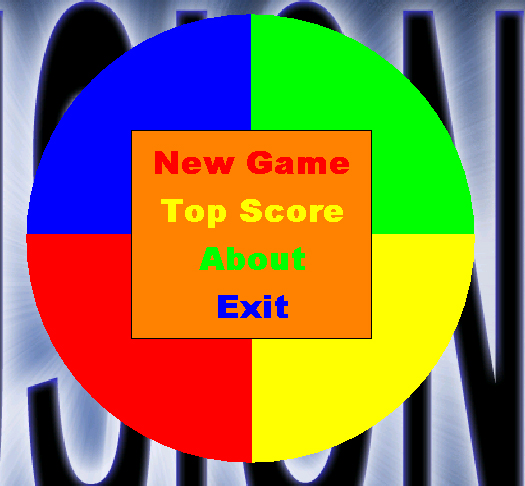



## ColourGame

### Description

This is just a fun game I put together. The object is to click the color that is written. NOT the color of the text or the color said out loud. Its not a complicated game but I sure have had fun with it. BTW I didnt finish the high score code, Ive got another project Im workin on.
 
### More Info
 

             |
---                |---
**Submitted On**   |2003-07-19 01:07:16
**By**             |[FuSioN0220](https://github.com/Planet-Source-Code/PSCIndex/blob/master/ByAuthor/fusion0220.md)
**Level**          |Beginner
**User Rating**    |5.0 (10 globes from 2 users)
**Compatibility**  |VB 6\.0
**Category**       |[Games](https://github.com/Planet-Source-Code/PSCIndex/blob/master/ByCategory/games__1-38.md)
**World**          |[Visual Basic](https://github.com/Planet-Source-Code/PSCIndex/blob/master/ByWorld/visual-basic.md)
**Archive File**   |[ColourGame1620647272003\.zip](https://github.com/Planet-Source-Code/fusion0220-colourgame__1-47201/archive/master.zip)

